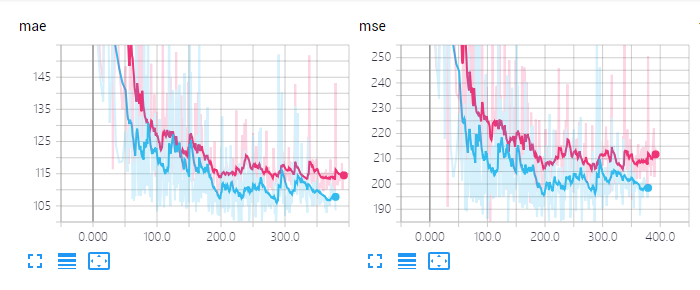
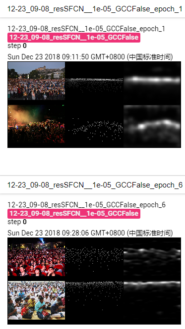
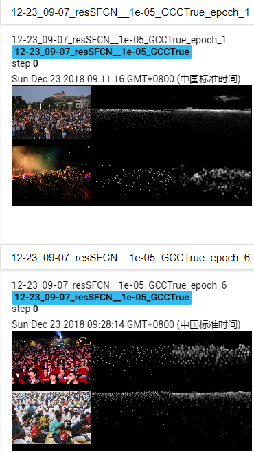
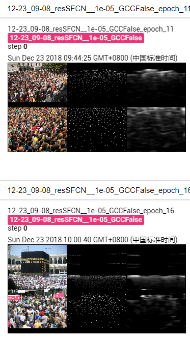
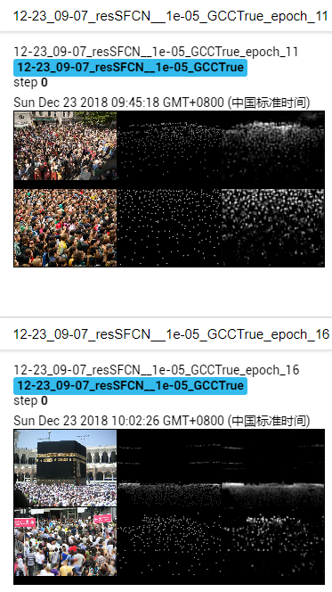
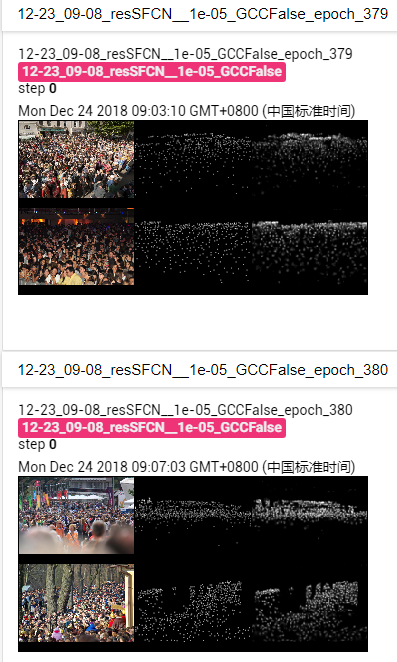
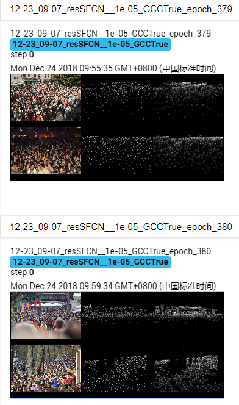

# SFCN in "Learning from Synthetic Data for Crowd Counting in the Wild"

This is an official implementaion of the paper "SFCN+" in **Learning from Synthetic Data for Crowd Counting in the Wild**. More detialed information of the paper is shown in the [project homepage](https://gjy3035.github.io/GCC-CL/).


##  Requirements
- Python 2.7
- Pytorch 0.4.0 
- TensorboardX (pip)
- torchvision  (pip)
- easydict (pip)
- pandas  (pip)


## Data preparation
1. Download the original UCF-QNRF Dataset [Link: [Dropbox ](http://crcv.ucf.edu/data/ucf-qnrf/)]
2. Resize the images and the locations of key points. 
3. Generate the density maps by using the [code](https://github.com/aachenhang/crowdcount-mcnn/tree/master/data_preparation).
4. Generate the segmentation maps.

The pre-trained resSFCN on GCC and the processed QNRF dataset: [[Link](https://mailnwpueducn-my.sharepoint.com/:f:/g/personal/gjy3035_mail_nwpu_edu_cn/EjgL9bSXYO1GvgdLIigURQUBPZ2GMDmPpF71JZTBtWj_jA?e=VAWhFB)]

## Training model
1. Run the train.py: ```python train.py```.
2. See the training outputs: ```Tensorboard --logdir=exp --port=6006```.


## Expermental results

### Quantitative results

Errors on test set:



Note: the blue line is the result of using pre-trained GCC Dataset, and the red is the result of using pre-trained ImageNet. 
 
 
### Visualization results

|   | Pre-trained ImageNet | Pre-trained GCC | 
|------|:------:|:------:|
| epoch 1,6| |  | 
| epoch 11,16 | |  | 
| epoch 379,380 | |  | 

Column 1: input image; Column 2: density map GT; Column 3: density map prediction.


## One More Thing

We reproduce some classic networks (MCNN, CSRNet, SANet, etc.) and some solid baseline networks (AlexNet, VGG, ResNet, etc.) on GCC dataset. Welcome to visit this [link](https://github.com/gjy3035/C-3-Framework). It is under development, we will release it as soon as possible.

## Citation
If you find this project useful for your research, please cite:
```
@inproceedings{wang2019learning,
  title={Learning from Synthetic Data for Crowd Counting in the Wild},
  author={Wang, Qi and Gao, Junyu and Wei, Lin and Yuan, Yuan},
  journal={Computer Vision and Pattern Recognition (CVPR)},
  year={2019}
}
```


